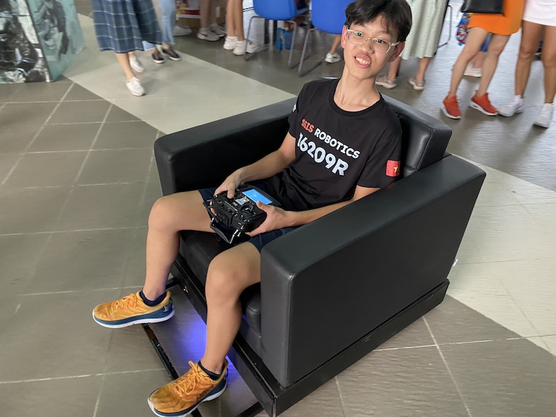
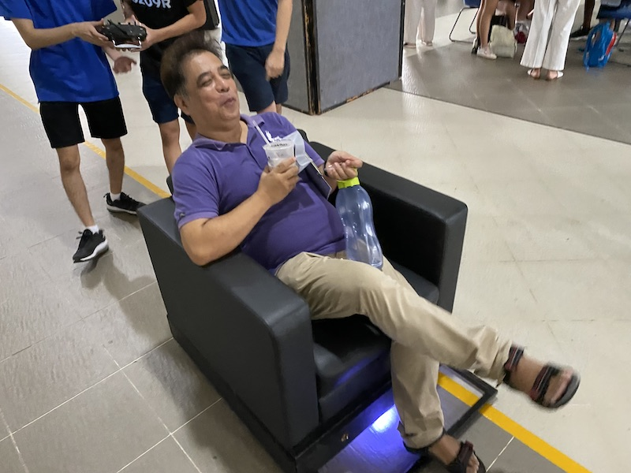
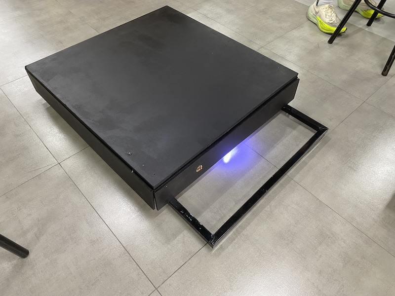
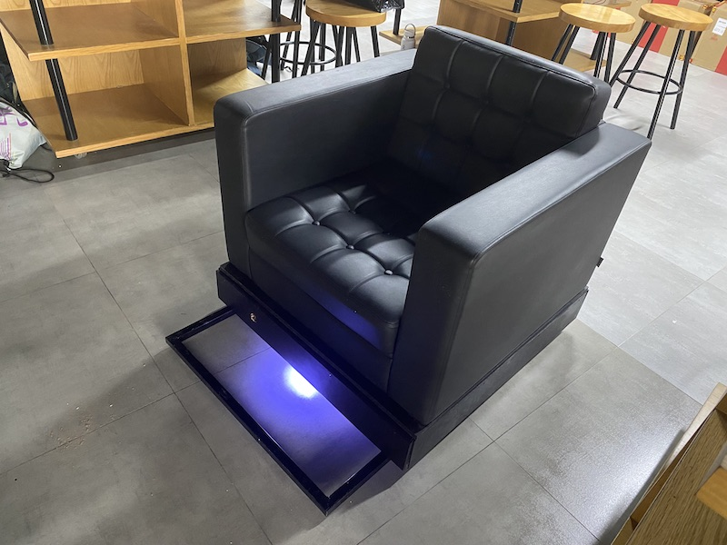
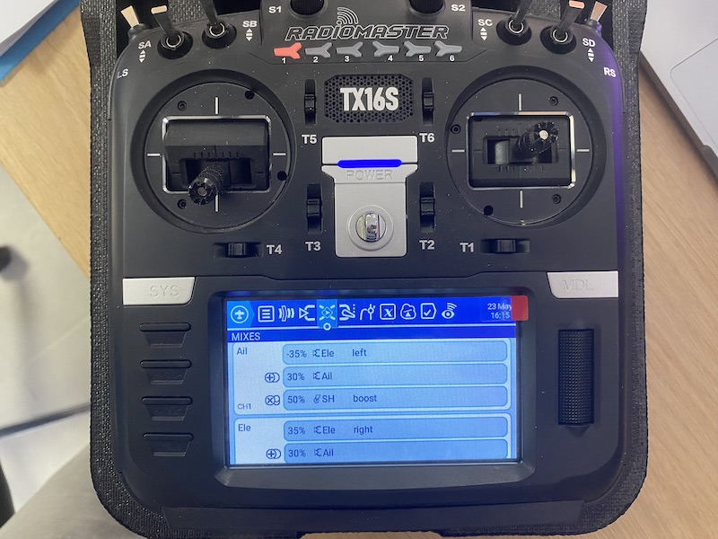
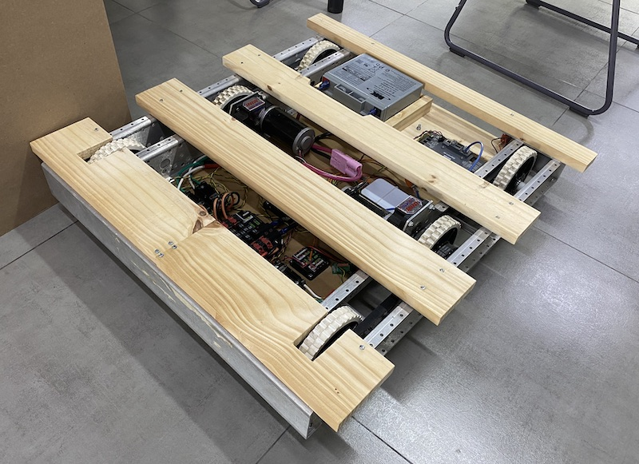
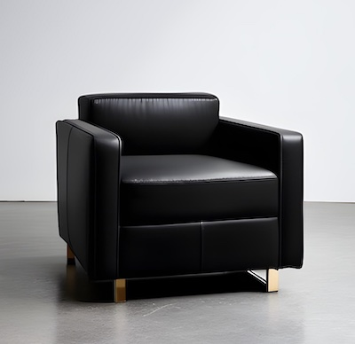
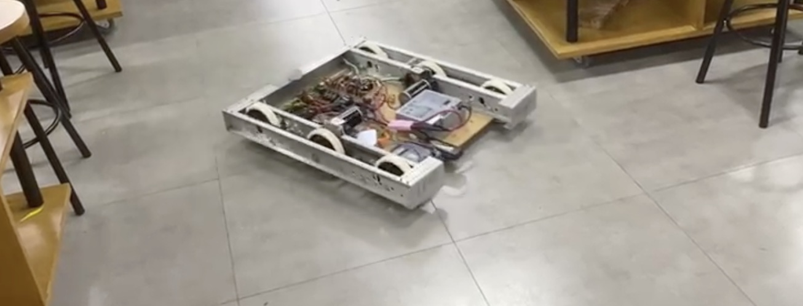
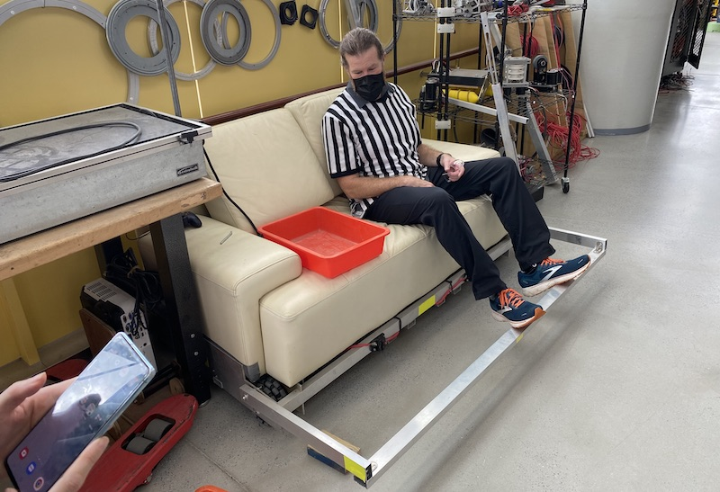

# Driving armchair for RESET 2023

Driving armchair on the FRC 2020 drivebase for the art show "RESET" on May 25th, 2023.

### 2023/05/25 Excited visitors and users

This project was a huge success. Many people wanted to take a ride on the chair, from young to old. And they enjoyed it!

 

So much that the two CIM motors actually overheated 🥵 and reduced their power. We had to make a break to let them cool a little:

## Building timeline

### 2023/05/25 Finished "black box" and successful mount

The final paint was put on the robot in the morning, and a few minutes into the art party the armchair was mounted on the base and driven out the office - to much amusement of all the bystanders, who took pictures and videos.

 

### 2023/05/23 Adjusted mixing parameters

In order to have the base turning we need at least 30% on the output signal. 35% is chosen to drive a little faster, and a boost button is there too. Hopefully we don't need a helmet for the exhibition.

### 2023/05/19 Programming the controller with EdgeTX

After updating the Radiomaster T16S from EdgeTX 2.6.0 to 2.8.3 some final configurations were necessary. For example to correctly mix Aileron and Elevation to channel 1 and 2 for the left and right motor respectively. The output display on the controller looks promising, time to test it on Monday.

### 2023/05/18 Finishing the base

Now we have the base for a repurposed leather armchair we try to borrow:

  

It is solid enough to hold a chair, and the remote works. In high speed mode it's really fun on the plaza!

### 2023/05/15 Secure place for battery, cables and receiver

The last state of the design from March 2020 had no dedicated space for the battery, and some connections were rather loose. The MDF base plate is very thin and bends under load. A new 22mm wooden structure to hold the lead battery in place was cut, screwed and glued together. A separate power switch for the 5V power supply of the radio was installed. Now the glue needs to dry.

### 2023/05/11 Remote control works - proof of concept

The cheap RC controller runs on 5 Volt (from an ESC with 7.4V LiPo battery, driving a BLDC drone motor) and puts out a PWM signal. Connecting this to a [Talon SRX](https://www.vexrobotics.com/217-8080.html) it worked and controlled a CIM motor, powered by an adjustable DC station with 12 Volt.

### 2022/12/04 Spark idea at visit to TAS in Taipei

The Taipei American School has a great robotics program, now in their Techcube on 5 floors. On the 4th floor is a couch that can be driven with a RC remote. Students love this idea! A girl in 2nd grade saw this and decided "I want to become an engineer". Following through with Lego robotics, VEX IQ, VEX V5 and FRC robotics competition she progressed towards that goal. Let's inspire more students!

